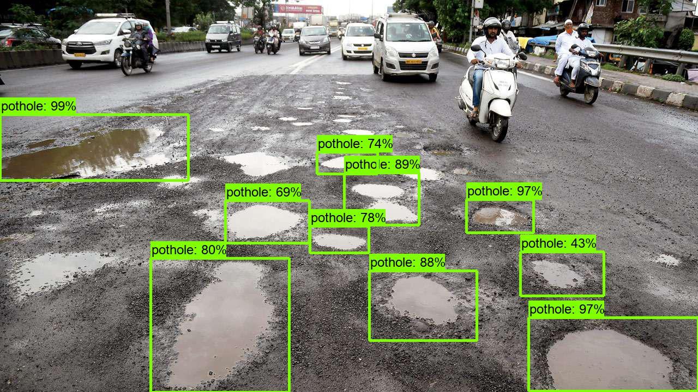

# Pothole Detection

## Dataset
I scrapped pothole images from google, resized them to 300x300 and annotated them using LabelImg. Training data containg 691 images and testing data contains 50 images.

## Usage

Run app.py to start the flask app server on localhost. You can then send POST request as JSON in the format {"file_path:"URL of image"} to the server.
firebase_url.py gets the ngrok tunnel url and updates it on firebase. I tried ssd_inception_v2_coco, ssd_mobilenetv2_oidv4 and faster_rcnn_inception_v2_coco models from <a href="https://github.com/tensorflow/models/blob/master/research/object_detection/g3doc/detection_model_zoo.md">TensorFlow’s detection model zoo</a>. 

Link to my <a href="https://drive.google.com/drive/folders/1ei8UV1kacMx8CZKcssU0RhIs_0LEGb3Z?usp=sharing">models</a>

## References
<a href="https://tensorflow-object-detection-api-tutorial.readthedocs.io/en/latest/training.html">Training Custom Object Detector — TensorFlow Object Detection API tutorial documentation</a>
